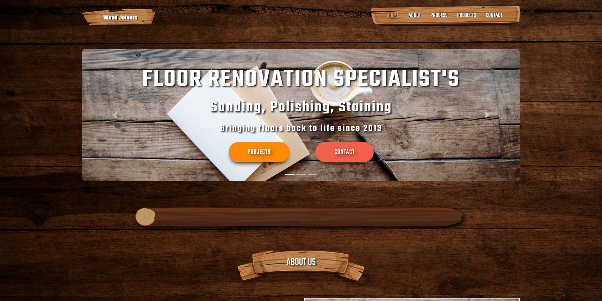

# WoodJoiners Website

This is a website designed and developed for a wood renovation business. Designed with Adobe XD, developed using Gatsby JS and Sanity CMS.

## Table of contents

- [WoodJoiners Website](#woodjoiners-website)
  - [Table of contents](#table-of-contents)
  - [Overview](#overview)
    - [Links](#links)
    - [Website Screenshot](#website-screenshot)
    - [Sanity CMS Screenshot's](#sanity-cms-screenshots)
  - [My process](#my-process)
    - [Built with](#built-with)
    - [What I learned](#what-i-learned)
  - [Author](#author)

## Overview

### Links

- Website URL: [Wood Joiners](https://woodjoiners.netlify.app)
- Sanity CMS Github URL: [Sanity Github](https://github.com/tosia921/Wood-Joiners-Sanity-CMS)

### Website Screenshot



### Sanity CMS Screenshot's

This is a screenshot of a Sanity CMS that allow user to add projects categories and projects related to those categories that are later displayed on a website. Each time user adds new content or edits existing one, netlify webhook is triggered and Gatsby site gets rebuild.


## My process

### Built with

- Semantic HTML5 markup
- Flexbox
- CSS Grid
- [React](https://reactjs.org/) - JS library
- [Gatsby.js](https://www.gatsbyjs.com/) - React framework
- [Sanity CMS](https://www.sanity.io/) - For managing website content
- [Styled Components](https://styled-components.com/) - For styles

### What I learned

- How to use Gatsby plugins system.

- How to query for internal and external data in Gatsby using GraphQL.

- How to use Gatsby image component for optimizing and lazy loading.

- How to dynamicly create static pages in Gatsby:

```js
const path = require("path")
// Implement the Gatsby API “createPages”. This is called once the
// data layer is bootstrapped to let plugins create pages from data.
exports.createPages = async ({ graphql, actions, reporter }) => {
  const { createPage } = actions
  // Query for markdown nodes to use in creating pages.
  const result = await graphql(
    `
    {
      allSanityProject {
        edges {
          node {
            id
            slug {
              current
            }
          }
        }
      }
      allSanityCategory {
        edges {
          node {
            id
            Category
          }
        }
      }
    }

    `
  )
  // Handle errors
  if (result.errors) {
    reporter.panicOnBuild(`Error while running GraphQL query.`)
    return
  }
  // Create pages for each markdown file.
  const ProjectTemplate = path.resolve(`src/templates/project.js`)
  result.data.allSanityProject.edges.forEach(({ node }) => {
    const path = `projects/${node.slug.current}`
    createPage({
      path,
      component: ProjectTemplate,
      // In your blog post template's graphql query, you can use pagePath
      // as a GraphQL variable to query for data from the markdown file.
      context: {
        id: node.id,
      },
    })
  })

  const categoryTemplate = path.resolve(`src/pages/projects.js`)
  result.data.allSanityCategory.edges.forEach(({ node }) => {
    const path = `category/${node.Category}`
    createPage({
      path,
      component: categoryTemplate,
      // In your blog post template's graphql query, you can use pagePath
      // as a GraphQL variable to query for data from the markdown file.
      context: {
        category: node.Category,
      },
    })
  })
}
}
```

## Author

- Tomasz Posiadala - [Tomasz Posiadala](https://www.tomaszposiadala.com)
